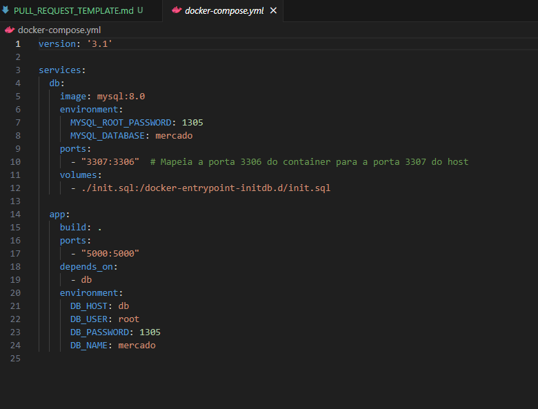
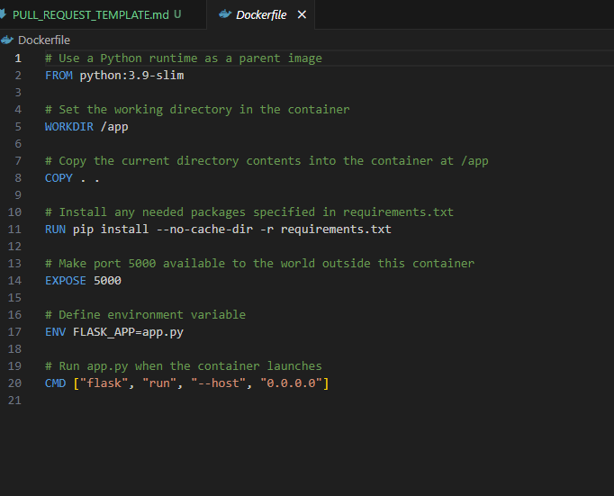

# Pull Request

## Descrição

Este pull request adiciona o Docker ao projeto, permitindo a execução do aplicativo Python que gera e gerencia um banco de dados sobre um mercado.

## Alterações Realizadas

- Criação do `Dockerfile` para configurar o ambiente Docker.
- Criação do `docker-compose.yml` para orquestrar os contêineres.
- Atualização do código Python para garantir compatibilidade com Docker.

## Prints

print docker-compose.yml

print dockerfile

## Membros do Grupo

- Viktor
- Stefano

## Checklist

- [X] O código segue os padrões de estilo e boas práticas do projeto.
- [X] As mudanças foram testadas e validadas.